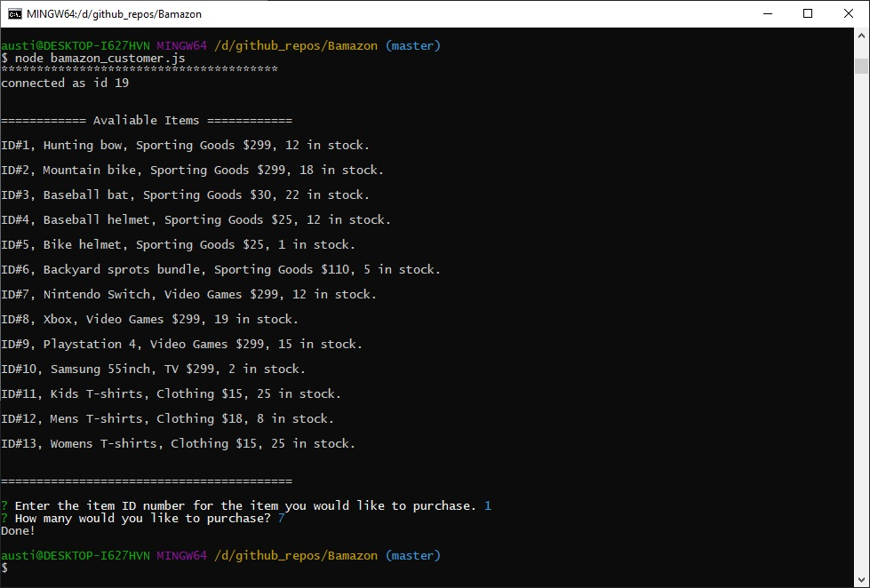
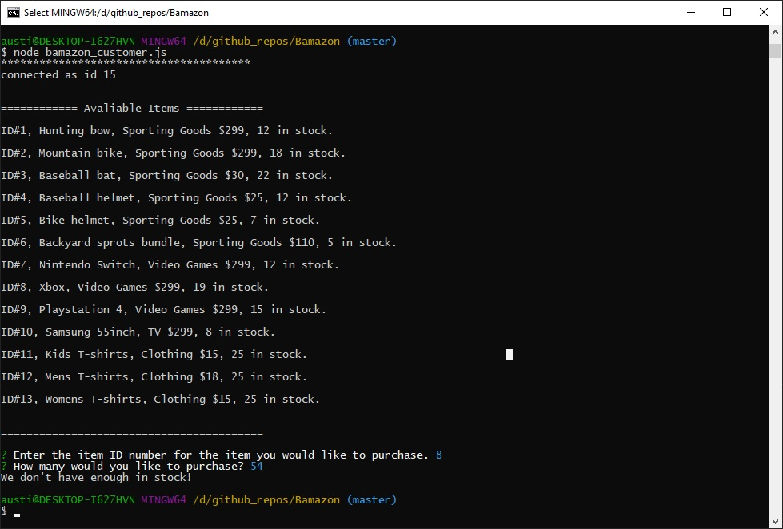
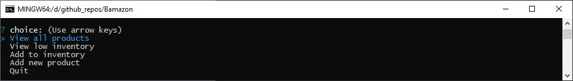
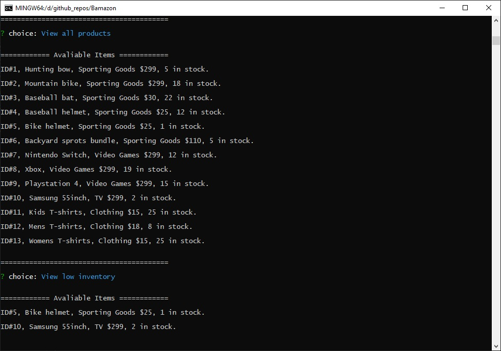
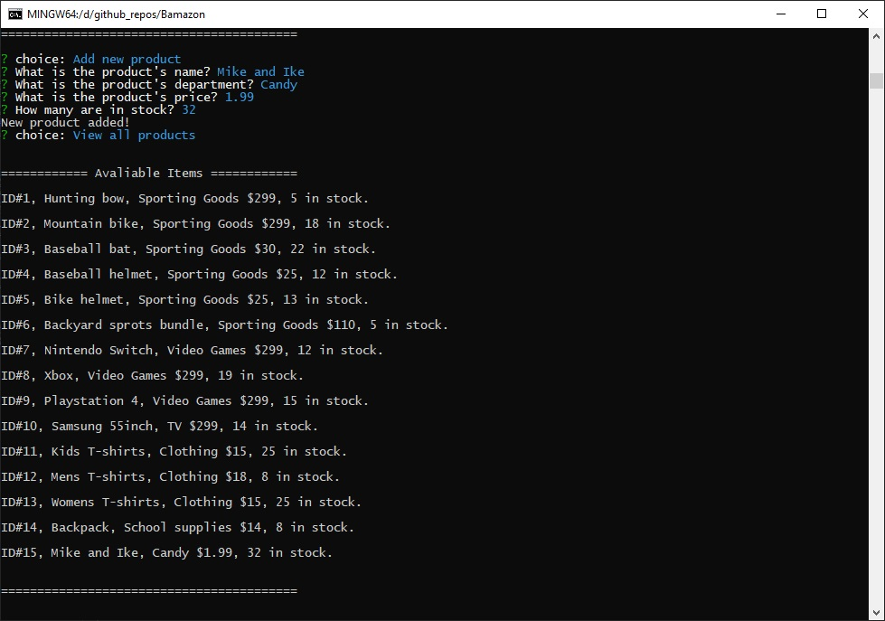

# Bamazon
 
## Overview
* A basic mySql data manipulation app.

## bamazon_customer.js

* Allows the user two buy items from the store.

* If the store does not have enought items in stock the purchase does not go through.

## bamazon_manager.js

* built in menu for easy use

### Low Inventory
* Allows the user to check all items in database for low stock, returns the items that are less than 5.

### Increase stock & add Product
* The first function allows the user to add more inventory to existing items. The add product function will prompt the user to add a new item to the store.

#### Code by Austin Fletcher.